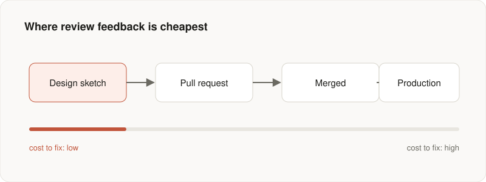

Most teams treat code review as a checkpoint where someone confirms the code
compiles, the tests pass, and the style is consistent. That is worth doing, but
it is the least valuable thing review can do.

The reviews that change how a codebase ages are the ones that engage with
design: the shape of an abstraction, the names, the boundaries between modules.
Those are worth discussing while they are still cheap to change.

## Feedback gets more expensive over time

A comment on a design sketch costs an afternoon. The same comment on a merged,
deployed system costs a migration.



That is the argument for reviewing intent early, from a short design note, a
draft PR, or a diagram. By the time a thousand-line change arrives, it is hard
to unwind, both practically and for the person who wrote it.

## Review the diff you can't see

The valuable review question is rarely whether a given line is correct. It is
whether this is the right thing to build at all. A few questions tend to
surface that:

```text
- What did this change make harder to do next?
- Which name will a new engineer misread six months from now?
- What's the smallest version of this that would still be worth shipping?
- If this breaks at 3 a.m., what will the on-call engineer wish existed?
```

None of these are about the lines on screen. They are about the lines that are
missing: the abstraction the author chose, and the alternatives they passed
over.

## Make it safe to be early

You only get design-level feedback when people share work before it is
polished. That takes a culture where a rough draft is welcome, and where
saying "I'm not sure about this shape yet" is a normal thing to write in a
pull request.

Review is one of the few moments where a whole team thinks about the same
problem at once. Spend it on the questions that are expensive to get wrong.

---

*This is a sample post with placeholder content. Replace it, or publish a real
article straight from a GitHub issue.*
