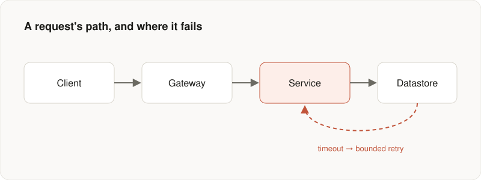

Every system works on the happy path. The interesting question — the one that
separates a prototype from something you can put your name on — is what happens
the moment reality stops cooperating: a slow dependency, a partial deploy, a
burst of traffic three times larger than your last capacity test.

The systems that survive aren't the ones that never fail. They're the ones that
fail in small, predictable, recoverable ways.

## Make failure a first-class case

The most common design mistake is treating errors as an afterthought — a
`catch` block bolted on once the feature "works." Instead, sketch the failure
modes before you write the happy path.



For every dependency, ask three questions: What happens if it's *slow*? What
happens if it's *down*? What happens if it returns something *wrong*? Each
answer is a design decision, not an accident.

## Bound everything

Unbounded work is the root of most production incidents. A retry without a
limit becomes a retry storm. A queue without a ceiling becomes an
out-of-memory crash. A request without a deadline becomes a thread leak.

```ts
async function callDependency<T>(fn: () => Promise<T>): Promise<T> {
  const deadline = AbortSignal.timeout(2_000);
  let attempt = 0;

  while (true) {
    try {
      return await fn();
    } catch (err) {
      if (++attempt >= 3 || deadline.aborted) throw err;
      // Exponential backoff with jitter — never a tight loop.
      await sleep(2 ** attempt * 100 + Math.random() * 100);
    }
  }
}
```

The numbers matter less than the principle: every loop has an exit, every wait
has a ceiling, every call has a deadline.

## Design for the operator, not just the user

Six months from now, someone — possibly you — will be staring at this system
at 3 a.m. They will not have the context you have today. The logs, metrics,
and error messages you write now are a letter to that person.

A good system tells you *why* it's unhealthy, not just *that* it is. That's a
design property, and like all design properties, it's far cheaper to build in
than to retrofit.

---

*This is a sample post — placeholder content for the new blog. Replace it, or
publish a real article straight from a GitHub issue.*
