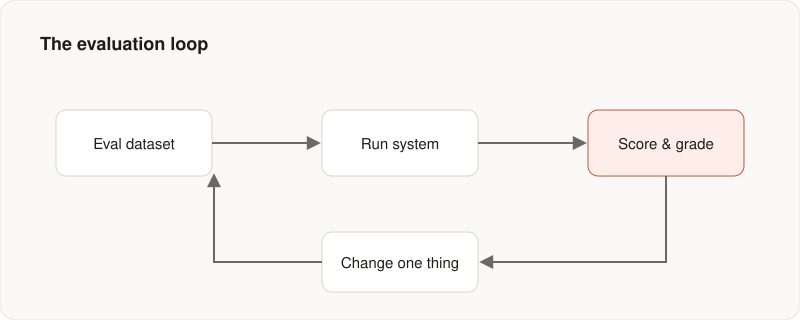

The hardest part of building with large language models is not getting a demo
to work. It is knowing whether your last change actually made things better.
Without evaluation, every prompt tweak is a guess and every release is a leap
of faith.

The fix is not exotic. It is the same discipline used everywhere else in
engineering. Decide what good means, measure it, and keep measuring as you
change things.

## Start with a dataset

Before touching the prompt, collect twenty to fifty real examples of the task:
real inputs paired with the outputs you would consider correct. This set of
examples is the most useful thing you will build in the whole project.



A small, honest dataset beats a large one full of examples you wish were
representative. You will end up reading these examples more than any other file
in the project.

## Grade with something repeatable

Reading outputs by hand does not scale, and it does not survive the next
refactor. Put the judgement into code instead. Even a rough rubric beats a gut
feeling.

```python
def grade(example, output) -> float:
    score = 0.0
    if example.must_mention in output:
        score += 0.5                      # did it cover the key fact?
    if not contains_hallucinated_url(output):
        score += 0.3                      # did it stay grounded?
    if len(output) <= example.max_length:
        score += 0.2                      # did it respect the format?
    return score
```

Some checks are deterministic. Others, like tone or faithfulness, are better
judged by another model. Both approaches are fine. The property that matters is
that the grade is reproducible. Run it twice on the same output and you should
get the same score.

## Change one thing at a time

With a dataset and a grader you have a loop. Run the eval, record the score,
change one thing, and run it again. Either the score moves or it does not, and
both outcomes teach you something concrete.

The goal is simple: replace guessing with a number you trust.

---

*This is a sample post with placeholder content. Replace it, or publish a real
article straight from a GitHub issue.*
